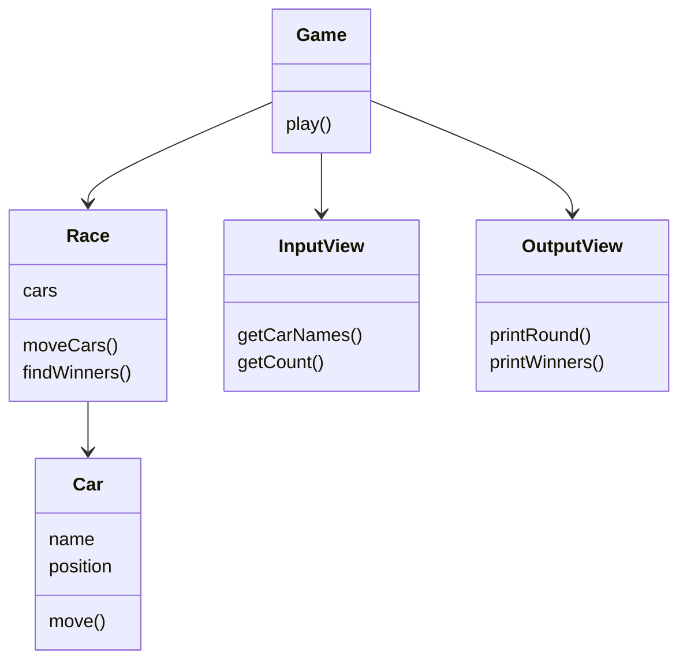

# java-racingcar-precourse

## 요구사항 분석 (Requirement)

### 기능 요구사항
초간단 자동차 경주 게임을 구현한다.
- 입력
  - 각 자동차에 이름을 부여할 수 있다.
  - 자동차 이름은 쉼표(,)를 기준으로 구분하며 5자 이하만 가능하다.
  - 게임 실행 횟수를 입력할 수 있다.
- 게임
    - 주어진 횟수 동안 n대의 자동차는 전진 또는 멈출 수 있다.
    - 전진하는 조건은 0~9 사이의 무작위 값이 4 이상일 경우 전진한다.
- 출력
    - 매 라운드 종료 후 각 자동차의 현재 위치를 출력한다.
    - 게임 종료 후 최종 우승자를 출력한다.
    - 우승자가 여러 명일 경우 쉼표(,)로 구분하여 출력한다.

### 예외 처리
잘못된 값을 입력할 경우 IllegalArgumentException을 발생시키고 애플리케이션을 종료한다.

- 자동차 이름이 5자를 초과한 경우
- 자동차 이름 또는 실행 횟수 입력이 없는 경우
- 실행 횟수가 100회를 초과한 경우

## 입출력 요구 사항
### 입력
경주할 자동차 이름(이름은 쉼표(,) 기준으로 구분)
```
pobi,woni,jun
```
시도할 횟수
```
5
```

### 출력
단독 우승자 안내 문구
```
최종 우승자 : pobi
```
공동 우승자 안내 문구
```
최종 우승자 : pobi, jun
```

### 실행 결과 예시
```
경주할 자동차 이름을 입력하세요.(이름은 쉼표(,) 기준으로 구분)
pobi,woni,jun
시도할 횟수는 몇 회인가요?
5

실행 결과
pobi : -
woni : 
jun : -

pobi : --
woni : -
jun : --

pobi : ---
woni : --
jun : ---

pobi : ----
woni : ---
jun : ----

pobi : -----
woni : ----
jun : -----

최종 우승자 : pobi, jun
```

## 도메인 설계



### Car
경주 게임에서 자동차의 이름과 현재 위치를 담당한다.

- 자동차 이름은 공백 불가, 5자 이하로 제한
- 자동차 생성 시 위치는 0으로 초기화

#### 주요 메서드
- validate() : 자동차 이름의 유효성 검증 (null, 공백, 5자 초과 시 예외 발생)
- move() : 자동차 위치 1 증가
- getName() : 자동차 이름 반환
- getPosition() : 자동차의 현재 위치 반환

### Race
자동차들의 이동과 우승자 선별을 담당한다.

- 0~9 사이의 난수가 4 이상일 경우 자동차를 전진
- 가장 멀리 이동한 자동차를 우승자로 선별 (공동 우승 가능)

#### 주요 메서드
- moveCars() : 각 자동차에 대해 난수를 생성하여 전진 여부를 결정
- findWinners() : 가장 높은 위치값을 가진 자동차 목록을 반환
- getCars() : 현재 레이스에 참여 중인 자동차 목록을 반환

### Game
경주 게임의 전체 흐름을 제어하는 역할을 담당한다.

- 입력(InputView)과 출력(OutputView)을 통해 사용자와 상호작용
- 자동차 생성, 레이스 실행, 우승자 출력까지의 게임 흐름을 조율

#### 주요 메서드
- play() : 자동차 이름과 이동 횟수를 입력받아 레이스를 실행하고 우승자를 출력


## 테스트

도메인 로직의 신뢰성을 검증하기 위해 각 클래스에 대한 단위 테스트 및 통합 테스트를 작성하였다.

- [ApplicationTest](https://github.com/zzzyoonnn/java-racingcar-7-practice/blob/main/src/test/java/racingcar/ApplicationTest.java) : 실제 입출력 흐름을 기반으로 게임 전체 동작 및 예외 상황 통합 테스트
- [CarTest](https://github.com/zzzyoonnn/java-racingcar-7-practice/blob/main/src/test/java/racingcar/domain/CarTest.java) : 자동차 생성 시 유효성 검증 및 이동 기능에 대한 단위 테스트
- [RaceTest](https://github.com/zzzyoonnn/java-racingcar-7-practice/blob/main/src/test/java/racingcar/domain/RaceTest.java) : 단독 우승 및 공동 우승 시나리오에 대한 단위 테스트

## 패키지 구조
```
├── main
│   └── java
│       └── racingcar
│           ├── Application.java
│           ├── domain
│           │   ├── Car.java
│           │   ├── Game.java
│           │   └── Race.java
│           └── view
│               ├── InputView.java
│               └── OutputView.java
└── test
    └── java
        └── racingcar
            ├── ApplicationTest.java
            └── domain
                ├── CarTest.java
                └── RaceTest.java

```

## 구현 전략
초기 구현 단계에서는 기능 구현에 집중하여 하나의 클래스에서 로직을 작성하였다.  
이후 다음 기준으로 리팩토링을 진행하였다.

- 자동차의 이름과 위치 관리 → Car
- 경주 실행 및 우승자 선별 → Race
- 게임 흐름 제어 및 입출력 → Game

이를 통해 책임을 분리하고 각 클래스가 하나의 역할을 담당하도록 구조를 개선하였다.


## 프로그램 동작 흐름

1. 자동차 이름을 입력받는다.
2. 쉼표를 기준으로 이름을 분리하고 유효성을 검사한다.
3. 게임 실행 횟수를 입력받고 유효성을 검사한다.
4. 입력된 횟수만큼 게임을 실행한다.
5. 매 라운드 종료 후 각 자동차의 현재 위치를 출력한다.
6. 모든 라운드 종료 후 가장 멀리 이동한 자동차를 우승자로 선별한다.
7. 최종 우승자를 출력한다.